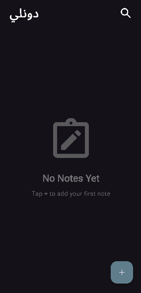
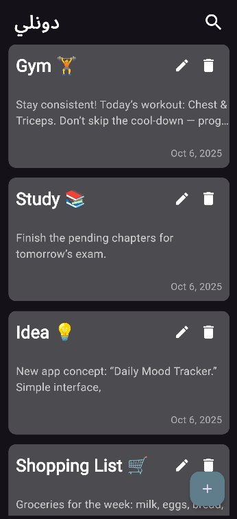

# 📝 Notes App

**Notes App** is a sleek and modern Flutter-based note-taking application that helps users organize their thoughts and ideas. With a beautiful dark theme UI, local storage, and intuitive design, it's the perfect companion for capturing your daily notes.

---

## 📸 Screenshots

| Empty State | Notes View | Add Note |
|-------------|------------|----------|
|  |  |  |

| Edit Page |
|-----------|
|  |

---

## ✨ Features

- 📋 **Note Management**: Create, read, update, and delete notes effortlessly  
- 💾 **Local Storage**: All notes stored locally using Hive database  
- 🎨 **Beautiful UI**: Elegant dark theme with smooth animations  
- 📝 **Rich Text Support**: Multi-line descriptions with title support  
- 🎯 **Empty State**: Friendly UI when no notes exist  
- ✏️ **Easy Editing**: Quick edit and delete options for each note  
- 📅 **Date Tracking**: Automatic date stamps for each note  
- 🔍 **Form Validation**: Input validation to ensure quality notes  
- ⚡ **Fast Performance**: Instant load times and smooth scrolling  
- 📱 **Responsive Design**: Works perfectly on all screen sizes  

---

## 🛠️ Tech Stack  

- **Flutter** - Cross-platform UI framework  
- **Hive** - Fast and lightweight local database  
- **flutter_bloc** - State management with BLoC pattern  
- **Cubit** - Simplified state management  
- **modal_progress_hud_nsn** - Loading indicators  
- **intl** - Date formatting and internationalization  

---

## 📁 Project Structure

```
lib/
├── cubit/
│   ├── add_note_cubit/
│   │   ├── add_note_cubit.dart
│   │   └── add_note_state.dart
│   └── notes_cubit/
│       ├── notes_cubit.dart
│       └── notes_state.dart
├── models/
│   ├── note_data_model.dart
│   └── note_data_model.g.dart
├── views/
│   ├── edit_note_view.dart
│   └── notes_view.dart
├── widgets/
│   ├── add_note_bottom_sheet.dart
│   ├── add_note_form_state.dart
│   ├── custom_app_bar.dart
│   ├── custom_bottom.dart
│   ├── custom_note_container.dart
│   ├── custom_txt_field.dart
│   ├── note_empty.dart
│   ├── notes_view_body.dart
│   └── notes_view_list.dart
├── simple_bloc_observer.dart
└── main.dart
```

---

## ⚙️ Getting Started

### Prerequisites

- Flutter SDK (^3.9.0)
- Dart SDK
- Android Studio / VS Code with Flutter extensions

### Installation

1. Clone this repository:

```bash
git clone https://github.com/YoussefShawky0/notes_app.git
```

2. Navigate to the project directory:

```bash
cd notes_app
```

3. Install dependencies:

```bash
flutter pub get
```

4. Generate Hive adapters:

```bash
flutter pub run build_runner build
```

5. Run the app:

```bash
flutter run
```

---

## 🎯 How to Use

1. **Add a Note**: Tap the floating action button (+) to create a new note
2. **Enter Details**: Fill in the title and description
3. **Save**: Tap the "Add" button to save your note
4. **Edit**: Tap the edit icon on any note to modify it
5. **Delete**: Tap the delete icon to remove a note
6. **View**: All your notes are displayed in a beautiful card layout

---

## 🏗️ Architecture

This app follows the **BLoC (Business Logic Component)** pattern with **Cubit** for state management:

- **Cubit Layer**: Handles business logic and state changes
- **Model Layer**: Data models with Hive type adapters
- **View Layer**: UI screens and navigation
- **Widget Layer**: Reusable UI components

---

## 📦 Dependencies

```yaml
dependencies:
  bloc: ^8.1.4
  flutter_bloc: ^8.1.6
  hive: ^2.2.3
  hive_flutter: ^1.1.0
  modal_progress_hud_nsn: ^0.5.1
  intl: ^0.20.2

dev_dependencies:
  hive_generator: ^2.0.0
  build_runner: ^2.4.6
```

---

## 🔮 Future Enhancements

- 🎨 Custom color themes for notes
- 🔍 Search functionality
- 📂 Categories/folders for organization
- 🔒 Password protection
- ☁️ Cloud sync with Firebase
- 📎 Attach images and files
- 🔔 Reminders and notifications
- 📊 Note statistics and insights

---

## 👨‍💻 Developer

**Youssef Shawky**
- GitHub: [@YoussefShawky0](https://github.com/YoussefShawky0)

---

## 📄 License

This project is licensed under the MIT License - see the LICENSE file for details.

---

## 🤝 Contributing

Contributions, issues, and feature requests are welcome! Feel free to check the [issues page](https://github.com/YoussefShawky0/notes_app/issues).

---

## ⭐ Show Your Support

If you like this project, please give it a ⭐ on GitHub!

---

# Happy Note-Taking! 📝✨
